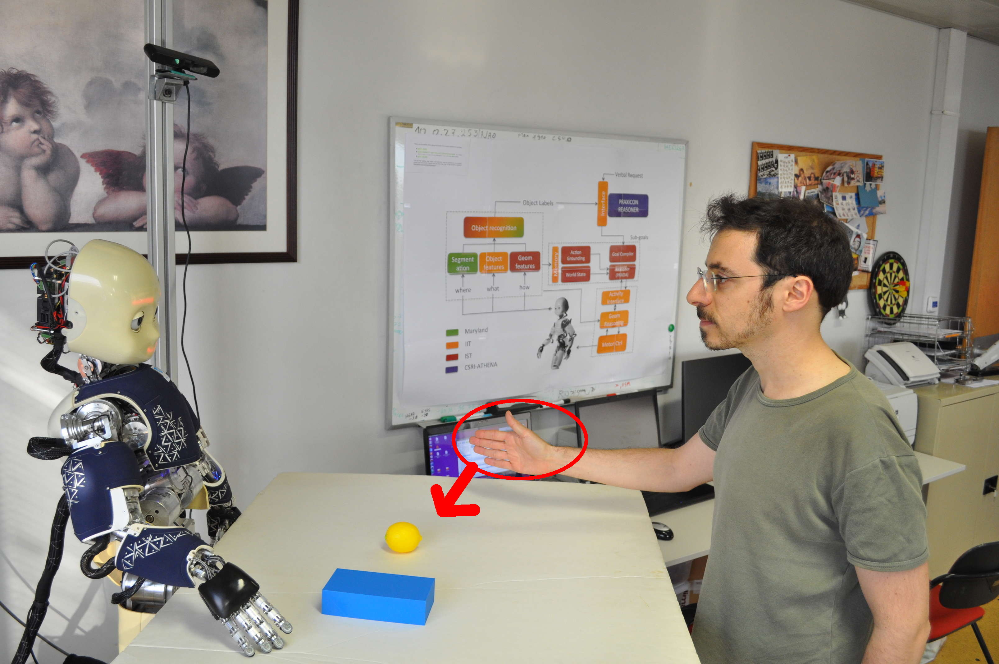

# glu-gestures
This repository contains code and material for this paper:

* Giovanni Saponaro, Lorenzo Jamone, Alexandre Bernardino and Giampiero Salvi. Interactive Robot Learning of Gestures, Language and Affordances. International Workshop on Grounding Language Understanding (GLU), INTERSPEECH 2017. [[article](http://www.isr.tecnico.ulisboa.pt/~gsaponaro/publications/saponaro-glu2017.pdf)]

## Description

Below we show the experimental setup, consisting of an iCub humanoid robot and a human user performing a manipulation gesture on a shared table with different objects on top. The depth sensor in the top-left corner is used to extract human hand coordinates for gesture recognition. Depending on the gesture and on the target object, the resulting effect will differ.

## References

This work is an extension of the following one:

* Giampiero Salvi, Luis Montesano, Alexandre Bernardino, José Santos-Victor. Language Bootstrapping: Learning Word Meanings From Perception-Action Association. IEEE Transactions on Systems, Man, and Cybernetics, Part B: Cybernetics, vol. 42, no. 3, June 2012. [[article](http://ieeexplore.ieee.org/document/6082460/)] [[code](https://github.com/giampierosalvi/AffordancesAndSpeech)]
